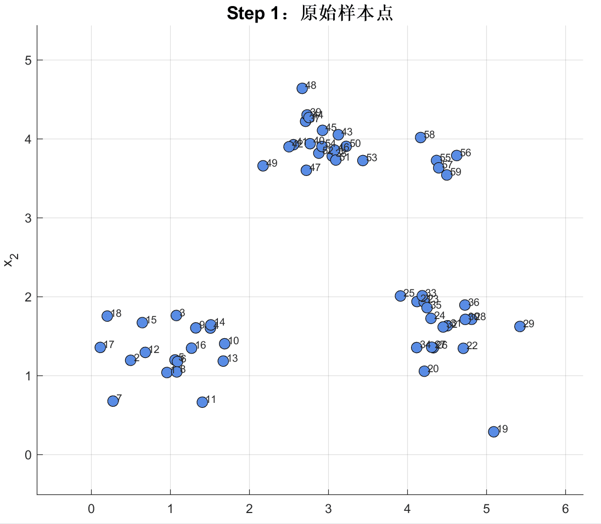

# K-Means Clustering Demo

一个基于 MATLAB 开发的 **K-means 聚类算法交互式可视化演示程序**。

本项目通过逐帧展示原始样本、初始聚类中心、样本分配、中心更新、目标函数变化和最终聚类结果，帮助初学者直观理解 K-means 算法的基本原理与迭代过程。

## 项目预览



## 算法流程

K-means 是一种典型的基于距离的划分式聚类算法，其基本过程如下：

1. 从样本中随机选取 `K` 个点作为初始聚类中心。
2. 计算每个样本与各聚类中心之间的距离。
3. 将每个样本分配给距离最近的聚类中心。
4. 根据每个簇内样本的均值更新聚类中心。
5. 重复执行样本分配和中心更新。
6. 当聚类中心移动距离足够小，或达到最大迭代次数时停止。

## 默认数据说明

程序默认生成一组二维模拟数据。

默认数据包含三个主要样本分布和一个规模较小的局部分布，默认参数设置为：

```matlab
K = 3;
MaxIter = 10;
Seed = 5;
```

这一设置可以用于观察以下现象：

* K-means 需要预先指定聚类数量；
* 较小的局部分布可能被合并到距离较近的主要簇中；
* 不同的初始中心可能产生不同的聚类过程；
* 修改 `K` 和 `Seed` 可能改变最终聚类结果；
* K-means 更适合处理近似球状、规模相近的样本分布。

## 空簇处理

在 K-means 迭代过程中，某些聚类中心可能暂时没有任何样本归属，从而形成空簇。

本项目对空簇进行了处理：

1. 找到当前距离所属中心最远的样本；
2. 将该样本设置为空簇的新聚类中心；
3. 如果同时出现多个空簇，则依次选择不同的高误差样本；
4. 避免多个空簇中心完全重合。

这种处理方式可以提高演示程序在不同 `K` 值和随机初始化条件下的稳定性。

## 项目结构

```text
K-Means-Clustering-Demo/
├── demo.m
├── assets/
|   └── display.gif
├── README.md
└── LICENSE
```

## License

本项目基于 Apache-2.0 License 开源。

欢迎 Star ⭐ 和 Fork！

## 相关项目

* [Density Peaks Clustering Demo](https://github.com/LiMingKuan-UESTC/Density-Peaks-Clustering-Demo)

该项目使用 MATLAB 交互式展示密度峰值聚类算法的计算与聚类过程。
